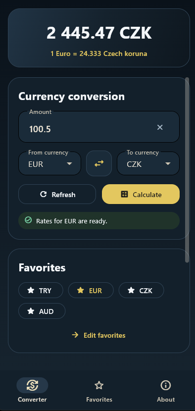
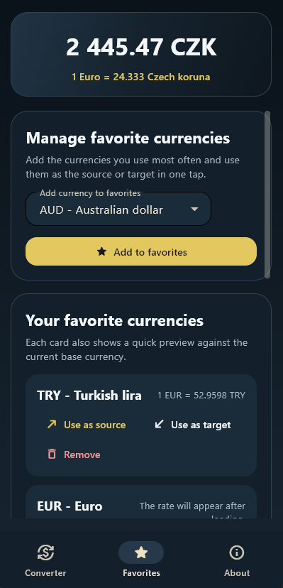
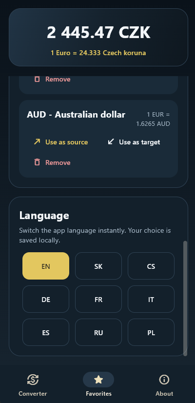
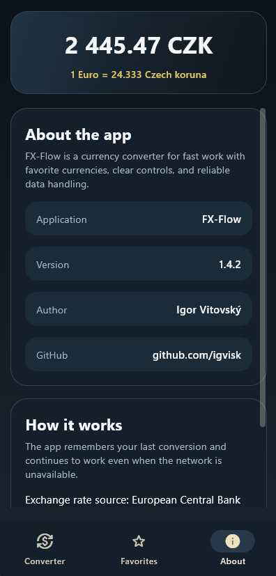

# FX-Flow

FX-Flow is a compact Flet currency converter built for quick everyday conversions, favorite-currency workflows, and graceful behavior when fresh network data is unavailable. The active app version in the codebase is `1.4.2`.

The current Python entrypoint is `fx_app.py`. Shared conversion, rate, cache, preference, and localization logic lives in `fx_core.py`.

## Preview

<p align="center">
  
  
  
  
</p>

## Overview

The app is organized around three bottom-navigation sections:

- `Converter` for amount entry, source/target selection, swapping, refreshing rates, and reading conversion details
- `Favorites` for managing the currencies that should appear in converter dropdowns
- `About` for app metadata and a short explanation of the data mode

Only currencies added to Favorites are offered in the converter. This keeps the conversion flow short while still allowing the full available rate list to feed favorite selection after rates have been loaded.

## Features

- Flet UI for desktop and Android-style mobile layouts
- Prominent conversion result with a one-unit rate line
- Live amount formatting while typing, grouping large numbers by thousands
- Favorite currencies as the main converter scope
- Quick favorite chips on the converter screen
- Favorite management with rate previews and source/target shortcuts
- Manual refresh and background refresh on startup or base-currency changes
- Online-first rate loading with local cache fallback
- Per-base cached rate snapshots in `rates-cache.json`
- Persistent favorites, last amount, last source/target currencies, and UI language
- Built-in localization for `en`, `sk`, `cs`, `de`, `fr`, `it`, `es`, `ru`, and `pl`
- Safe startup wrapper that displays a readable error screen if initialization fails

## How It Works

1. The app resolves a writable storage directory for the current platform.
2. It creates `rates-cache.json` and `preferences.json` stores in that directory.
3. If the new cache is empty, it can seed rates from a legacy `rates.json` file.
4. It loads saved preferences and normalizes favorites against available currencies.
5. It renders the last known conversion state immediately.
6. It starts an online refresh for the active base currency.
7. If the API request fails, it continues with the latest cached snapshot when available.

## Data Source And Storage

- Rate endpoint in code: `https://free.ratesdb.com/v1/rates`
- Request shape: `?from=<BASE_CURRENCY>`
- UI exchange-rate source label: `European Central Bank`
- UI also shows the API provider host from the configured endpoint
- Rate request timeout: `5` seconds
- Cache file: `rates-cache.json`
- Preferences file: `preferences.json`

Storage resolution is platform-aware:

- Windows: `%LOCALAPPDATA%\FX-Flow`
- Android: `~/FX-Flow`
- Other platforms: `~/.fx-flow`
- Writable fallbacks: `~/.fx-flow-data`, then `./.fx-flow-data`

## Project Structure

- `fx_app.py` - active Flet entrypoint, UI tabs, navigation, storage resolution, async refresh flow, and startup error screen
- `fx_core.py` - app metadata, locale loading, currency labels, amount parsing, rate provider, cache, and preference persistence
- `locales/` - JSON translations for the supported UI languages
- `assets/` - app icons and branding assets
- `images/` - README preview screenshots
- `APK_BUILD_NOTES.txt` - Android APK build command and project-specific packaging notes
- `fxflow-venv/` - local development virtual environment present in this workspace; not part of the app source itself

## Running Locally

Using the existing workspace virtual environment:

```powershell
.\fxflow-venv\Scripts\python.exe .\fx_app.py
```

Creating a fresh environment:

```powershell
py -3.13 -m venv .venv
.\.venv\Scripts\python.exe -m pip install --upgrade pip
.\.venv\Scripts\python.exe -m pip install flet==0.84.0 flet-cli==0.84.0 flet-desktop==0.84.0
.\.venv\Scripts\python.exe .\fx_app.py
```

The checked local environment currently uses Python `3.13.12` and Flet `0.84.0`.

## Android APK

Android packaging is documented in `APK_BUILD_NOTES.txt`. The current notes target:

- module name: `fx_app`
- project name: `fxflow`
- package / application ID: `com.igvisk.fxflow`
- build version: `1.4.2`
- build number: `6`

Expected APK output after a successful build:

```text
build\apk\fxflow.apk
```

## Windows Build

Windows packaging produces a portable application directory. Keep the full output folder together because the executable depends on adjacent DLL and data files:

```text
build\windows\fxflow.exe
```

## Notes

- Default language: `sk`
- Fallback language: `en`
- Default favorites: `EUR`, `USD`, `CZK`, `TRY`
- Default amount on first launch: `1`
- Amount parsing accepts both comma and dot decimal separators
- Amount display uses spaces between digit groups, for example `15000000` becomes `15 000 000`
- Negative amounts are rejected
- At least one favorite currency must remain available
- If fresh rates cannot be fetched, the app uses cached rates for the active base currency when possible
